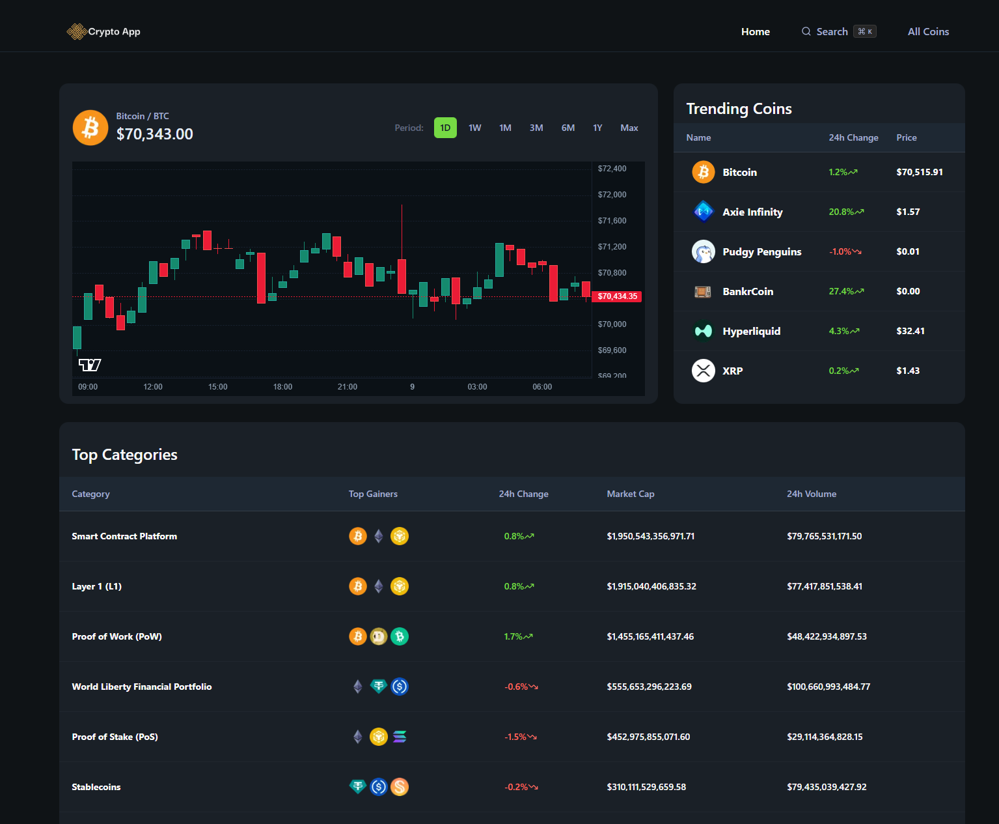

<div align="center">
  <br />
    <a href="https://cryptoapp-tan.vercel.app" target="_blank">
      
    </a>
  <br />

  <div>


  </div>

  <h3 align="center">Crypto App — Analytics Dashboard</h3>

   <div align="left">
In this tutorial project, I got hands-on experience with several popular web development tools and workflows. I practiced using TypeScript and became more familiar with the Next.js framework for building React applications. I also used shadcn/ui to quickly spin up UI components, which made it easier to build and iterate on the interface.

I worked with the CoinGecko API, learning how to explore its endpoints and integrate real-world data into the app. I also experimented with AI-assisted development by using JUNIE in the WebStorm IDE, which helped me implement extra features like a global search.

On the workflow side, I practiced using Git in the terminal and followed proper development practices, such as working on separate branches for features and bug fixes before opening pull requests.

With guidance from an experienced software developer, I got a glimpse of what working on a production-level project is like, including the added complexity, real-world constraints, and the thought process behind writing cleaner, more maintainable code.
    </div>
</div>

## 📋 <a name="table">Table of Contents</a>

1. ✨ [Introduction](#introduction)
2. ⚙️ [Tech Stack](#tech-stack)
3. 🔋 [Features](#features)
4. 🤸 [Quick Start](#quick-start)

## <a name="introduction">✨ Introduction</a>

CryptoPulse is a high-performance analytics dashboard built with Next.js 16, TailwindCSS v4, and shadcn/ui, delivering real-time market intelligence via CoinGecko’s API and WebSockets. It features high-frequency price tracking and live orderbook streams for low-latency updates, paired with interactive TradingView candlestick charts to visualize OHLCV data with surgical precision. From a dynamic homepage showcasing global stats and trending assets to robust token pages with multi-fiat converters and advanced search tables, the platform provides a modular, developer-friendly stack optimized for speed and clarity.

## <a name="tech-stack">⚙️ Tech Stack</a>

- **[Next.js](https://nextjs.org)** a React framework for building full-stack web applications quickly.

- **[TypeScript](https://www.typescriptlang.org/)** for type safety.

- **[Tailwind CSS](https://tailwindcss.com/)** a utility-first CSS framework.

- **[Shadcn/ui](https://ui.shadcn.com/docs)** a collection of React component.

- **[CoinGecko API](https://docs.coingecko.com)** documentation on coingecko api endpoints and usage.

- **[TradingView](https://www.tradingview.com/lightweight-charts/)** a financial visualization library that provides interactive charting capabilities for rendering complex OHLCV data.

## <a name="features">🔋 Features</a>

👉 **Home Dashboard**: Displays crucial market health indicators like **Total Market Cap** and **BTC & ETH dominance**, alongside a dynamic list of **Trending Tokens**.

👉 **Token Discovery Page**: A comprehensive, sortable and searchable table featuring key token metrics (Price, 24h change, Market Cap Rank) for mass market analysis.

👉 **Detailed Token Overview**: Provides an immediate summary of any selected token, including its logo, current price, and market cap rank.

👉 **Interactive Candlestick Chart**: Integrates **TradingView Lightweight Charts** to visualize market trends and price action.

👉 **Smart Currency Converter**: An interactive tool that allows users to instantly compute coin amounts into dozens of supported fiat and crypto currencies.

👉 **Exchange & Trading Pairs**: Allows users to analyze trading context by displaying aggregated lists of exchanges and available trading pairs.

👉 **Global Search Functionality**: Allows users to search any crypto asset by name or symbol.


## <a name="quick-start">🤸 Quick Start</a>

Steps to set up the project locally on your machine.

**Prerequisites**

Make sure you have the following installed on your machine:

- [Git](https://git-scm.com/)
- [Node.js](https://nodejs.org/en)
- [npm](https://www.npmjs.com/) (Node Package Manager)

**Cloning the Repository**

```bash
git clone https://github.com/adrianhajdin/coinpulse.git
cd coinpulse
```

**Installation**

Install the project dependencies using npm:

```bash
npm install
```

**Set Up Environment Variables**

Create a new file named `.env` in the root of your project and add the following content:

```env
COINGECKO_BASE_URL=
COINGECKO_API_KEY=

NEXT_PUBLIC_COINGECKO_WEBSOCKET_URL=
NEXT_PUBLIC_COINGECKO_API_KEY=
```

Replace the placeholder values with your real credentials from: [**CoinGecko API**](https://docs.coingecko.com).

**Running the Project**

```bash
npm run dev
```
